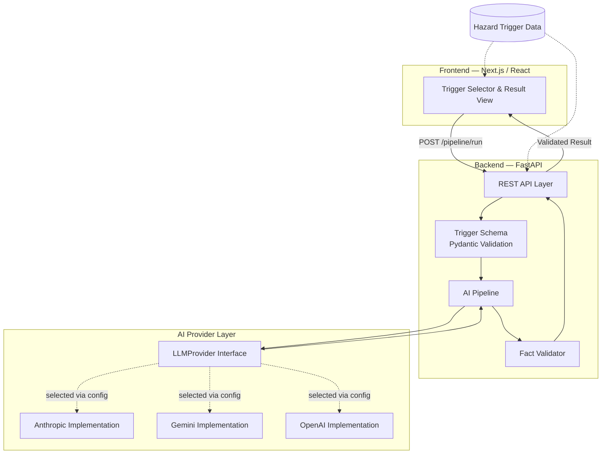
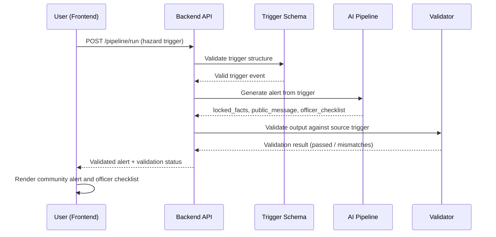

<div align="center">

# Sauti ya Tahadhari
### *Voice of Warning*

**Transforming technical hazard intelligence into clear, validated community warnings for the IGAD region.**

[](https://www.python.org/)
[](https://fastapi.tiangolo.com/)
[](https://nextjs.org/)
[](https://react.dev/)
[](#license)
[](#acknowledgements)

[Live Demo](#) · [API Reference](#api-endpoints) · [Report an Issue](#)

</div>

---

## Project Description

Sauti ya Tahadhari is an AI-assisted early warning system that converts structured hazard triggers into clear, localized, human-readable alerts — while preserving the accuracy of the original hazard data through an independent, automated validation pipeline.

The system demonstrates how artificial intelligence can assist emergency communication **without allowing the AI to alter critical hazard information**. Every safety-critical fact in a generated alert — hazard type, severity, location, threshold crossed, and timeframe — is locked to its source and independently re-verified before the alert is ever presented to a user.

Built for the **IGAD Hackathon 2026** ("Smarter Early Warning, Stronger Communities").

---

## Motivation

Regional climate authorities such as ICPAC already operate mature hazard detection infrastructure — systems that identify droughts, floods, locust outbreaks, and food insecurity risk as they cross defined thresholds. What remains difficult is the last mile: translating a technical hazard trigger into language that a specific community member, or a specific emergency officer, can understand and act on in time.

Sauti ya Tahadhari targets that gap directly, without duplicating the detection work regional agencies already do well.

---

## Problem Statement

- Technical hazard bulletins are written for technical audiences — dense, threshold-driven, and often not localized.
- Communities most exposed to climate hazards frequently have limited connectivity, variable literacy, and no access to the systems where raw hazard data is published.
- Emergency response officers need a translated, actionable checklist, not a raw data feed, to coordinate a response quickly.
- Existing alerting approaches that rely purely on generative AI for the entire message risk introducing factual drift into safety-critical content — a real risk in a life-and-property context, not a hypothetical one.

---

## Solution

Sauti ya Tahadhari accepts one structured hazard trigger and produces two synchronized outputs from it:

1. A short, plain-language **public warning message**.
2. A concise **action checklist** for a local disaster management officer.

Both outputs are generated from the same event so that communities and responders operate from a consistent picture. Before either output is shown, an independent validation stage re-checks every safety-critical fact in the generated content against the original trigger. Only validated alerts are presented to the user, and the validation result itself is displayed, not hidden.

---

## Key Features

| Feature | Description |
|---|---|
| **AI-assisted alert generation** | Converts a structured hazard trigger into plain-language public messaging using a large language model, via a provider-agnostic interface (see [Technology Stack](#technology-stack)). |
| **Fact validation pipeline** | An independent, non-AI validation step that re-checks every safety-critical field in the generated output against the original trigger, field by field, before display. |
| **Structured hazard trigger processing** | Hazard events are ingested as strongly-typed structured data (hazard type, severity, location, threshold crossed, timeframe), validated on input before being passed to the AI layer. |
| **Community-focused language** | Public-facing messages are constrained to plain, non-technical language intended for a general audience. |
| **Officer action checklist generation** | Generates a role-specific, actionable checklist for local emergency response coordination, derived from the same trigger event. |
| **Interactive frontend dashboard** | A web interface for selecting a hazard trigger, generating an alert, and reviewing the validated result. |
| **API-driven architecture** | All core functionality is exposed through a documented REST API, independent of any specific frontend. |

---

## System Architecture



**Design note:** the AI provider layer is deliberately abstracted behind a single interface so that the active provider (Anthropic, Gemini, or OpenAI) can be changed through one configuration value, without modifying the pipeline, the API, or the frontend.

---

## Workflow Diagram



---

## Technology Stack

### Frontend
- **Next.js** — React framework, deployed on Vercel.
- **React** — Component-based UI.

### Backend
- **FastAPI** (Python) — REST API framework with automatic interactive documentation.
- **Pydantic** — Structured data validation for hazard trigger events.

### AI
- Large Language Model for message generation, accessed through a provider-agnostic interface.
- Supported implementations: **Anthropic (Claude)**, **Google Gemini**, **OpenAI**. The active provider is selected via a single environment variable (`LLM_PROVIDER`) — no code changes required to switch.

### Core Pipeline
1. A structured hazard trigger is received.
2. The AI layer generates a community-friendly alert and an officer action checklist.
3. An independent validation stage compares the generated content against the original, locked source facts.
4. Only validated alerts are presented to the user.

---

## Project Structure

```
.
├── backend/
│   ├── api/
│   │   └── main.py              # FastAPI application and route definitions
│   ├── ai/
│   │   ├── pipeline.py          # Core trigger -> AI -> validation orchestration
│   │   ├── prompt_template.py   # Constrained-generation prompt design
│   │   ├── validator.py         # Independent fact-validation logic
│   │   └── providers/
│   │       ├── base.py                  # LLMProvider abstract interface
│   │       ├── factory.py               # Provider selection via config
│   │       ├── anthropic_provider.py
│   │       ├── gemini_provider.py
│   │       └── openai_provider.py
│   ├── schemas/
│   │   └── trigger.py           # TriggerEvent data model
│   ├── data/
│   │   └── sample_triggers.json # Sample hazard trigger events
│   ├── tests/
│   │   └── test_pipeline_validator.py  # End-to-end pipeline/validator test
│   ├── requirements.txt
│   └── .env.example
├── frontend/
│   ├── pages/
│   │   ├── _app.js
│   │   └── index.js             # Main application UI
│   ├── styles/
│   │   └── globals.css
│   ├── package.json
│   └── .env.local.example
└── README.md
```

---

## Installation

### Prerequisites
- Python 3.12+
- Node.js 18+ and npm
- An API key for at least one supported LLM provider (Anthropic, Gemini, or OpenAI)

### Clone the repository
```bash
git clone <add repository URL>
cd sauti-ya-tahadhari
```

### Backend setup
```bash
cd backend
pip install -r requirements.txt
```

### Frontend setup
```bash
cd frontend
npm install
```

---

## Running Locally

### 1. Start the backend
```bash
cd backend
# set environment variables — see Environment Variables section below
uvicorn api.main:app --reload --port 8000
```
The interactive API documentation is available at `http://localhost:8000/docs`.

### 2. Start the frontend
```bash
cd frontend
cp .env.local.example .env.local
# set NEXT_PUBLIC_API_URL in .env.local to your backend URL
npm run dev
```
The application is available at `http://localhost:3000`.

---

## Environment Variables

### Backend (`backend/.env` — copy from `.env.example`)

| Variable | Required | Description |
|---|---|---|
| `LLM_PROVIDER` | Yes | Selects the active AI provider. One of `anthropic`, `gemini`, `openai`. |
| `LLM_MODEL` | No | Overrides the default model for the selected provider. |
| `ANTHROPIC_API_KEY` | Conditional | Required if `LLM_PROVIDER=anthropic`. |
| `GEMINI_API_KEY` | Conditional | Required if `LLM_PROVIDER=gemini`. |
| `OPENAI_API_KEY` | Conditional | Required if `LLM_PROVIDER=openai`. |

> `SUPABASE_URL`, `SUPABASE_KEY`, `TWILIO_ACCOUNT_SID`, and `TWILIO_AUTH_TOKEN` are reserved for planned future functionality (persistent storage and delivery channels — see [Future Improvements](#future-improvements)) and are not consumed by the current codebase.

### Frontend (`frontend/.env.local` — copy from `.env.local.example`)

| Variable | Required | Description |
|---|---|---|
| `NEXT_PUBLIC_API_URL` | Yes | Base URL of the running backend API (e.g., `http://localhost:8000` locally, or your deployed backend URL). |

---

## API Endpoints

| Method | Endpoint | Description |
|---|---|---|
| `GET` | `/` | Basic service information. |
| `GET` | `/health` | Health check; returns the currently configured LLM provider. |
| `POST` | `/pipeline/run` | **Core endpoint.** Accepts a hazard trigger, returns the validated generated alert. |
| `POST` | `/triggers` | Accepts a hazard trigger, processes it, and persists the full record (in-memory) for later retrieval. |
| `GET` | `/triggers` | Lists all processed trigger records. |
| `GET` | `/triggers/{trigger_id}` | Retrieves a single processed trigger record by ID. |
| `GET` | `/samples` | Returns the built-in sample hazard trigger events. |
| `POST` | `/triggers/load-samples` | Convenience endpoint: processes every sample trigger in one call. |

---

## Example Usage

### Request

```bash
curl -X POST http://localhost:8000/pipeline/run \
  -H "Content-Type: application/json" \
  -d '{
    "id": "trg_0001",
    "hazard_type": "drought",
    "severity": "warning",
    "location": "Marsabit County, Kenya",
    "threshold_crossed": "3-month SPI below -1.5",
    "timeframe": "next 5-7 days",
    "recommended_action_summary": "Activate livestock destocking protocol",
    "source": "icpac_documented_sample",
    "issued_at": "2026-07-29T06:00:00Z"
  }'
```

### Response

```json
{
  "locked_facts": {
    "hazard_type": "drought",
    "severity": "warning",
    "location": "Marsabit County, Kenya",
    "threshold_crossed": "3-month SPI below -1.5",
    "timeframe": "next 5-7 days"
  },
  "public_message": "A drought warning is active for Marsabit County over the next 5 to 7 days. Prepare your livestock for sale or relocation now to protect your herd and income.",
  "officer_checklist": [
    "Activate the local livestock destocking protocol for Marsabit County.",
    "Coordinate with livestock market actors and off-takers to support commercial destocking.",
    "Inform pastoralist community leaders about emergency destocking schedules and options.",
    "Monitor water points and grazing areas across affected zones over the next 5-7 days."
  ],
  "validation": {
    "passed": true,
    "mismatches": []
  }
}
```

---

## Future Improvements

- Live integration with ICPAC hazard data sources, replacing the current documented sample dataset.
- Persistent storage for processed triggers (planned: Supabase), replacing in-memory storage.
- Delivery channels beyond the web interface, including SMS and voice/IVR for offline and non-smartphone users (planned: Twilio).
- Multi-language support for generated alerts, validated with native speakers.
- Semantic-aware fact validation, reducing false-positive mismatches caused by formatting differences while continuing to catch genuine factual drift.
- An officer dashboard with historical trigger tracking and response status.

---

## Challenges

- **Provider reliability under real-world conditions:** development encountered an AI provider quota limitation and multiple model-availability changes on a different provider in quick succession. The provider-agnostic architecture allowed switching the active provider through a single configuration change rather than a pipeline rewrite.
- **Output truncation from provider-side reasoning behavior:** newer generative models were found to consume part of their output token budget on internal reasoning before producing the final response, occasionally truncating structured output. This was addressed by increasing the output token allowance and adjusting provider-level generation settings.
- **Balancing generation quality against factual guarantees:** ensuring generated language remained natural and locally appropriate while enforcing strict, unaltered accuracy for safety-critical fields required a two-stage design — constrained prompting combined with independent post-generation validation — rather than relying on prompting alone.

---

## Lessons Learned

- A safety guarantee expressed only as a prompt instruction is a request, not a guarantee; an independent, deterministic validation step is required to make such a guarantee verifiable.
- Abstracting AI provider access behind a single interface early in development materially reduced the impact of unplanned provider-side issues encountered during the build.
- Transparent disclosure of data provenance (clearly distinguishing documented sample data from live production data) is a design responsibility, not an afterthought, for systems intended to inform emergency decision-making.

---

## Contributors

| Name | Role |
| Kimani Steve | Solo builder — design, backend, frontend, AI pipeline |

---

---

## Acknowledgements

- **ICPAC** (IGAD Climate Predictions and Applications Centre) for the hazard data frameworks and schema this project is modeled on.
- **IGAD Hackathon 2026** ("Smarter Early Warning, Stronger Communities") for the challenge context.
- Built using FastAPI, Next.js, and large language model APIs from Anthropic, Google, and OpenAI.
